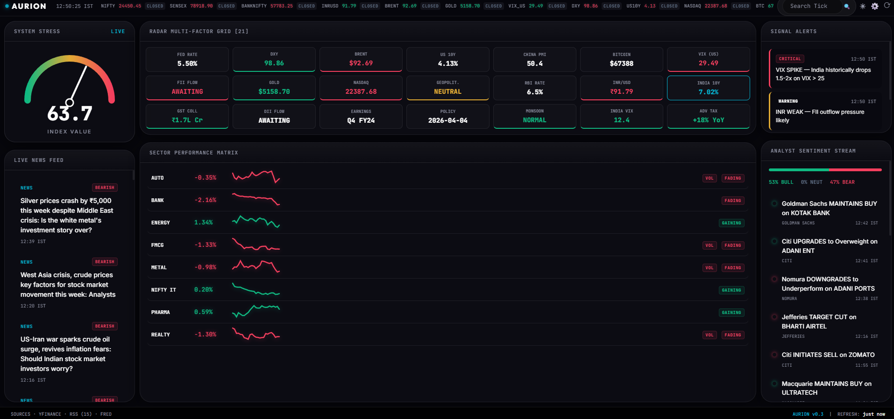
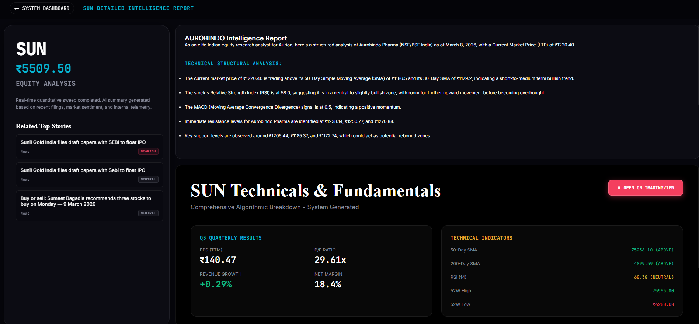

# AURION TERMINAL

### Real-Time Indian Equity Market Intelligence Dashboard


Aurion Terminal is a Bloomberg-inspired market dashboard built for Indian retail investors. It aggregates real-time data from NSE/BSE, global indices, commodities, forex, and 15+ news sources into a single cinematic interface — powered by AI-driven sentiment analysis, live charting, and autonomous intelligence reports.

**One command. Zero API keys required for core functionality.**

```bash
python main.py
```

---

## Screenshots

### Main Dashboard — 21-Factor RADAR Grid with Live Price Changes


The dashboard displays real-time market stress index (gauge), 21-factor radar grid with live percentage changes, sector performance with sparklines, classified news feed, sentiment stream, and signal alerts — all updating continuously with Bloomberg-style live blink animations.

### Stock Deep-Dive — AI Intelligence Report + TradingView Chart


Click any ticker to open a full analytics overlay with live TradingView chart, AI-generated fundamental & technical report (via Gemini), contextual news, and key financial metrics — all streamed in real-time.

---

## Features

### Market Data & Telemetry
- **11 Global Tickers** — NIFTY 50, SENSEX, Bank NIFTY, Brent Crude, Gold, DXY, US 10Y, VIX, NASDAQ, INR/USD, BTC — live via yfinance
- **21-Factor RADAR Grid** — Macro, domestic, and global factors classified as BULLISH / BEARISH / NEUTRAL with live day-change (% and absolute points) displayed per tile
- **Market Stress Index** — Weighted composite gauge (0–100) combining VIX, INR, Crude, DXY, NIFTY, and US10Y with spike detection
- **8 Sector Trackers** — IT, Bank, Pharma, Auto, FMCG, Metal, Realty, Energy with intraday sparklines, momentum badges, and constituent drill-down
- **NSE Market Countdown** — Live open/close status with holiday-aware countdown timer

### News & Sentiment Intelligence
- **15 RSS Feeds** — Economic Times, MoneyControl, LiveMint, Reuters, Business Standard, NDTV Profit, Hindu BusinessLine, Financial Express, and more
- **Algorithmic Sentiment Classification** — 100+ keyword classifier tags every article as BULLISH, BEARISH, or NEUTRAL
- **India-Relevance Filtering** — 70+ keyword filter ensures only market-relevant news surfaces
- **FII/DII Flow Extraction** — Regex-based parsing of institutional flow data from headlines
- **Signal Alerts** — Auto-generated anomaly alerts (VIX spikes, INR weakness, crude surges, sell-offs)

### AI Intelligence Engine
- **LLM-Powered Reports** — On-demand stock/sector analysis via Google Gemini 2.5 Flash with web-search grounding
- **Streaming AI Output** — Reports stream in real-time with typewriter effect
- **Multi-Provider Support** — Configurable for Google, OpenAI, Anthropic, Groq, or OpenRouter (BYO API key, stored in localStorage only)
- **Contextual News Matching** — Each ticker overlay shows relevant news filtered by keyword matching

### User Experience
- **Bloomberg Terminal Aesthetic** — Dark glassmorphism UI with JetBrains Mono typography, live-blink animations on active tickers, and micro-fluctuating prices
- **Drag & Drop RADAR** — Reorder the 21-factor grid tiles to your preference
- **Custom Stock Tracking** — Add any NSE/BSE ticker to your personal tracking list
- **TradingView Integration** — Embedded interactive charts for all tickers and sectors
- **Light/Dark Theme** — Toggle between Obsidian (dark) and Light themes, persisted to localStorage
- **Dhan CSV Integration** — Loads thousands of tickers from local Dhan stock database for instant search with autocomplete
- **Zero Build Tooling** — No npm, no webpack, no React — pure vanilla JS that loads instantly

---

## Quick Start

### Prerequisites

- Python 3.9 or higher

### Installation

```bash
git clone https://github.com/abhishek-admin/aurion-terminal.git
cd aurion-terminal
pip install -r requirements.txt
python main.py
```

Open **http://localhost:5000** in your browser. Data appears within 5–10 seconds (pre-warm cycle).

> Dependencies auto-install on first run if missing — you can skip the `pip install` step.

### Setting Up AI Reports

1. Get a free API key from [Google AI Studio](https://aistudio.google.com/)
2. Click the **Settings** gear icon (⚙️) in the top-right corner of Aurion
3. Paste your Gemini API key and click **Save**
4. Click any ticker → the AI report streams automatically

---

## Architecture

```
aurion-terminal/
├── main.py                 # Flask server, data fetching, all API endpoints
├── templates/
│   └── index.html          # Dashboard layout + CSS design system
├── static/js/
│   ├── utils.js            # Clock, IST time formatting, NSE countdown, theme
│   ├── market.js           # Market polling, price jitter, ticker strip rendering
│   ├── renderers.js        # RADAR grid, sectors, news, sentiment, stress gauge
│   ├── second-page.js      # Analytics overlay, TradingView widget, sector pages
│   ├── ai-engine.js        # LLM integration, streaming reports, stock analysis
│   ├── modals.js           # Settings, news popup, stock tracking modals
│   ├── search.js           # Ticker search with Dhan CSV autocomplete
│   └── init.js             # Bootstrap: initial polls + refresh intervals
├── screenshots/            # Dashboard screenshots
├── requirements.txt        # flask, feedparser, yfinance, requests
├── PROJECT.md              # Full build specification (LLM-reproducible)
└── README.md               # This file
```

### API Endpoints

| Endpoint | Method | Cache TTL | Description |
|----------|--------|-----------|-------------|
| `/` | GET | — | Dashboard HTML |
| `/api/market` | GET | 18s | Prices, stress index, FII/DII, RBI dates, market hours |
| `/api/news` | GET | 60s | Classified news (max 80 items) |
| `/api/sectors` | GET | 30s | Sector performance + sparklines |
| `/api/sector/<name>` | GET | 60s | Constituent stocks with live prices |
| `/api/refresh` | POST | — | Force-clear all caches |

### Polling Intervals

| Data | Interval | Method |
|------|----------|--------|
| Market prices | 18s | Backend yfinance fetch |
| News feeds | 60s | Backend RSS parse |
| Sectors | 30s | Backend yfinance fetch |
| Price micro-jitter | 350ms | Client-side simulation |
| Stress gauge jitter | 500ms | Client-side simulation |
| IST Clock | 1s | Client-side |

---

## Tech Stack

| Layer | Technology |
|-------|-----------|
| Backend | Python / Flask |
| Market Data | yfinance (Yahoo Finance) |
| News Feeds | feedparser (15 RSS sources) |
| AI Engine | Google Generative Language API (Gemini 2.5 Flash) |
| Frontend | Vanilla HTML5 / CSS3 / ES6 JavaScript |
| Charts | TradingView embedded widgets |
| Typography | JetBrains Mono + Inter + Space Grotesk + Outfit |

**Zero frontend dependencies.** No React, no D3, no Chart.js. All SVG charts, animations, and modals are built with vanilla JavaScript.

---

## Credits

- **[WorldMonitor](https://github.com/petermartens98/WorldMonitor)** by @petermartens98 — MIT License — architectural inspiration
- **yfinance** — Apache 2.0 — market data
- **feedparser** — BSD — RSS parsing
- **Flask** — BSD-3 — web framework
- **TradingView** — charting widgets

---

## Disclaimer

*This software is for educational and research purposes only. AI-generated reports, sentiment indicators, and financial data displayed by Aurion Terminal should NOT be construed as investment advice. Always consult a qualified financial advisor before making investment decisions.*
